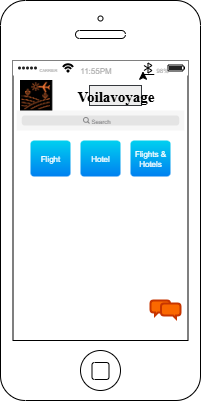

# ✈️ Voilavoyage - Travel Booking App

**Vpilavoyage** is a mobile travel application designed to help users easily search and book **flights**, **hotels**, or both. The app provides a clean and intuitive interface tailored for a smooth booking experience.



---

## 📱 Features

- 🔍 **Search** functionality to find flights, hotels, or packages
- 🎫 Book **Flights**
- 🏨 Book **Hotels**
- 🌐 Combine **Flights & Hotels**
- 💬 Integrated chat/help button
- ✨ Simple and responsive UI

---

## 🛠️ Tech Stack
| Tool         | Purpose                        |
|--------------|--------------------------------|
| [diagrams.net](https://app.diagrams.net) | UI wireframing & mockup |
| PNG Exports  | Sharing UI visuals             |
| GitHub       | Version control & documentation |

---

---

## 🚧 Installation & Setup

> Clone this repo and open it with your preferred development environment.

```bash
🙋 Contact
For questions, collaboration, or feedback, feel free to connect:

👤 Sean Anderson
🔗 https://www.linkedin.com/in/sean-anderson-484530310
📧 seananderso809@gmail.com
